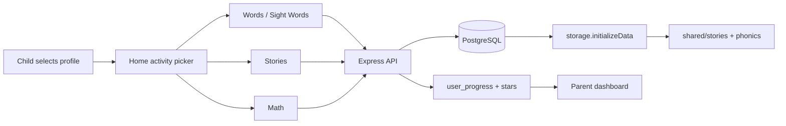

# Architecture

LearningLaunch is a full-stack TypeScript monorepo for early childhood reading and math.

## Directory layout

```
LearningLaunch/
├── client/                 # React 18 frontend (Vite)
│   └── src/
│       ├── pages/          # Route pages (home, reading, math, books, …)
│       ├── components/     # UI components (kid-ui, letter-box, admin, …)
│       ├── lib/            # speech.ts, page-help.ts, words.ts, queryClient, utils
│       ├── hooks/
│       └── data/           # Legacy words.json
├── server/                 # Express API
│   ├── index.ts            # Server entry
│   ├── routes.ts           # REST routes
│   ├── storage.ts          # Database layer + content seeding
│   ├── db.ts / db-docker.ts / db-switch.ts
│   └── vite.ts             # Vite dev middleware
├── shared/                 # Shared between client & server
│   ├── schema.ts           # Drizzle schema + Zod types
│   ├── phonics.ts
│   ├── phoneme-sounds.ts
│   ├── reading-words.ts    # Word seed data (levels 1–6)
│   ├── phonics/            # Vowel contrast modules (short-long-a, short-long-i, …)
│   └── stories/            # Phonics story source files
├── docs/                   # This documentation
├── scripts/                # docker-push.sh, etc.
├── docker-compose.yml
├── docker-compose.hub.yml
├── portainer-stack.yml
└── Dockerfile
```

## Tech stack

| Layer | Technology |
|-------|------------|
| Frontend | React 18, TypeScript, Vite, Tailwind CSS, Framer Motion |
| Routing | Wouter |
| Server state | TanStack React Query |
| UI primitives | Radix UI (shadcn/ui pattern) |
| Backend | Express.js, TypeScript |
| Database | PostgreSQL 15, Drizzle ORM |
| Sessions | connect-pg-simple |
| Speech | Kokoro-FastAPI + Web Speech API |

## Data flow



## Startup sequence

1. `server/index.ts` starts Express
2. `storage.initializeData()` runs:
   - Seeds reading words, level-6 sentences, math, books, sight words if missing
   - Backfills phonics on existing words
   - Incrementally adds new story books on upgrade
3. Vite serves client in dev; static assets in production
4. Drizzle schema pushed via `drizzle-kit push` (Docker entrypoint)

## Database tables

| Table | Purpose |
|-------|---------|
| `users` | Child profiles |
| `user_progress` | Per-activity completion |
| `reading_words` | Word practice content |
| `reading_books` | Story metadata |
| `reading_book_pages` | Story pages + teaching meta |
| `sight_words` | Sight word drills |
| `math_activities` | Counting & addition |
| `achievements` | Earned badges |
| `sessions` | Auth sessions |

Schema: `shared/schema.ts`

## Environment

| Variable | Purpose |
|----------|---------|
| `DATABASE_URL` | PostgreSQL connection string |
| `SESSION_SECRET` | Express session encryption |
| `NODE_ENV` | `development` or `production` |

## Design principles

- **Kid-first UI** — large touch targets, Fredoka/Nunito fonts, bright gradients, bottom nav, 🦉 spoken help on every activity page (`page-help.ts` + `KidHelpButton`)
- **Immediate feedback** — animations, TTS, stars on success
- **Parent visibility** — progress dashboard without cluttering kid experience
- **Content as code** — stories and phonics in `shared/` for version control; runtime in Postgres for admin edits

## Fonts

Loaded via Google Fonts / CSS: **Nunito**, **Balsamiq Sans**, **Fredoka** (kid headings)
